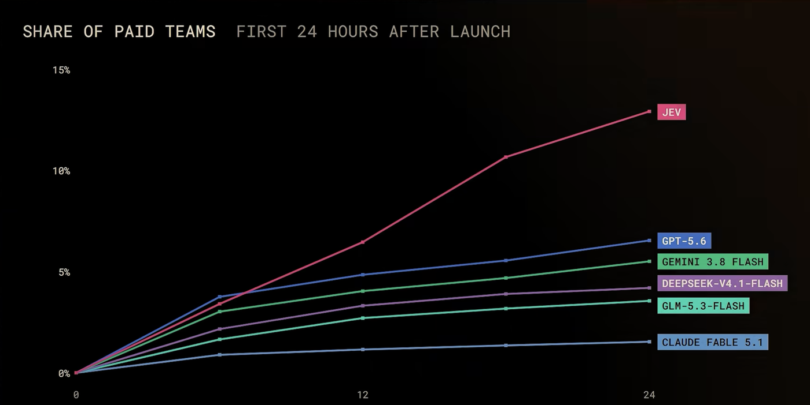
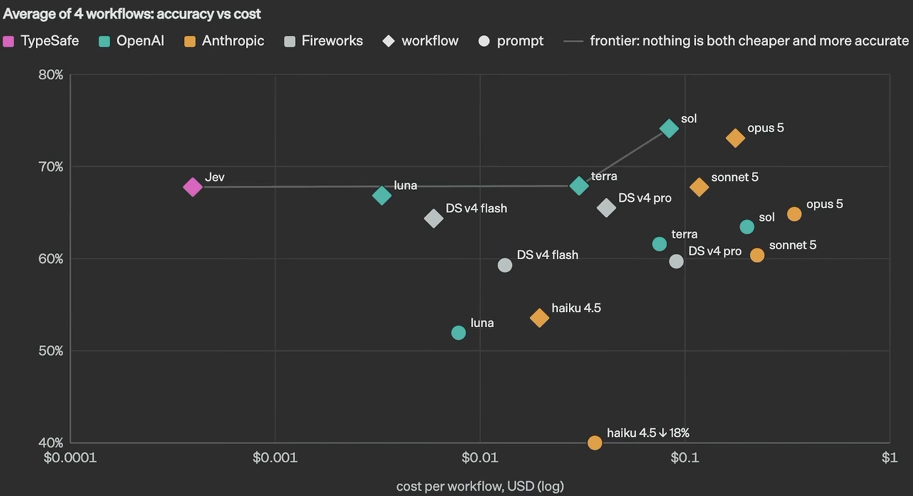
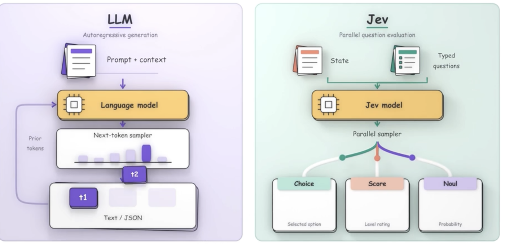
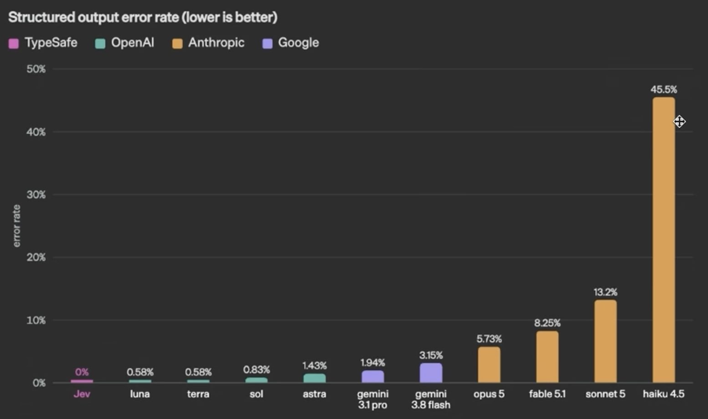
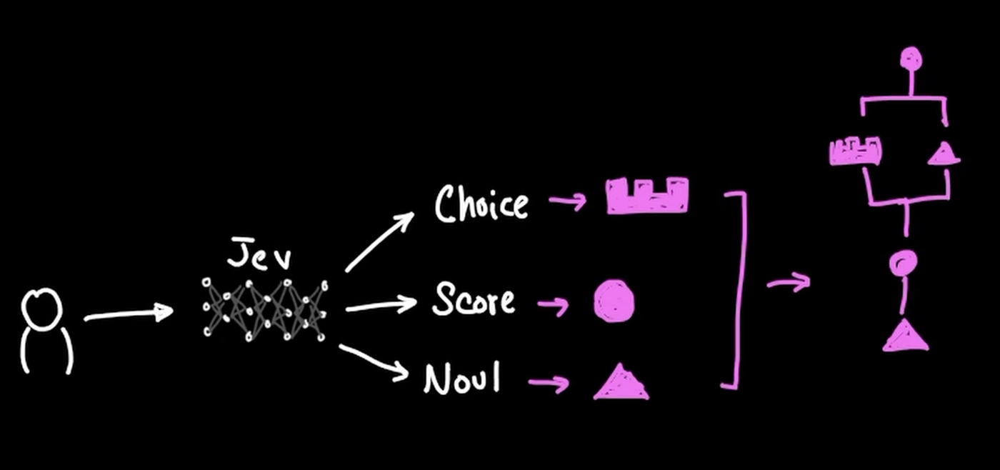

# Not Just Another Switch Statement

### A switch statement, but smarter and cheaper

## You're Paying a 5-Star Chef to Toast Bread

Somewhere in someone's workflow automation system, a 200 **billion** parameter model is deciding whether an email is spam or not.

It's the same model that can write your projects, debug buggy codeforces codes, explain a topic the night before an exam, and summarize a 100 page PDF in seconds. And someone has asked it to say one word: "spam" or "lead."

That's like hiring a 5-star chef to press the button on the toaster. The toast comes out. You might want to check the invoice.

This pattern has become almost invisible. Somewhere in the pipeline, an LLM call is performing a job that used to belong to a classical switch statement.

Route the workflow to agent A or agent B. Lead or spam? Score this transaction's fraud risk. None of these is a reasoning task in any meaningful sense.

They're closed-set classification problems with a fixed, enumerable list of outputs — and teams are routinely handing them to a model that was trained, and priced, to write essays and hold open-ended conversations.

It works, in the sense that it produces an answer. But "works" is doing a lot of quiet, expensive lifting.

The core issue is simpler than the tooling makes it look: **not every natural-language problem is a reasoning problem. Some are decisions.**

## It's Just a Label, Not a Reasoned Answer

Strip away the prompt, loop, and graph engineering and most of these decision calls look identical:

> *"Given this support ticket, respond with exactly one of: billing, engineering, sales — allocate the task to the agent."*

That isn't a request for **reasoning**. It's a **switch statement wearing Doctor Strange's cape**.

You're handing a natural-language document to a model and asking it to pick a bucket from a short list. That looks more like a classification problem — one that was solved long before LLMs arrived.

What makes it expensive rather than merely inelegant is *how* a **frontier LLM** produces that label.

Being autoregressive by nature, classical LLMs sample one token at a time, each conditioned on everything before it, running the full weight of a frontier-scale network at every step — to deliver what amounts to a few bits of information.

It's like a jet engine powering a light switch: clear overkill for simple classification.

## Three Problems With Using LLMs as Decision Engines

### 1. Latency

Chat models are optimized to be *good enough, fast enough* for a human staring at a chat window, but they aren't made for running the hot path in application backends.

TypeSafe reports response times ranging from 3 to 329 seconds for the frontier LLMs in its comparison. That comparison may not represent identical workloads across models, so treat the range as vendor-reported rather than an independent benchmark.

Tolerable in a chat bubble. A serious bottleneck once that same call is embedded in application code — then multiplied by every query and every row in a batch job. It becomes the rate-determining step of your application.

### 2. Confidence

Ask a frontier LLM to classify something and it will almost *always* give you an answer. What it rarely gives you is a well-calibrated sense of how sure it is.

Even when you explicitly ask for a confidence estimate, these models tend to be **overconfident and inconsistent**.

So it can be confidently wrong — and you won't even doubt it.

A plain `if` statement is at least *honest about its boundaries*, because you wrote them yourself. An LLM playing `if` statement will misroute the 5% it doesn't understand with the exact same serene confidence it uses for the other 95%.

Same tone, same swagger, wrong department.

### 3. Edge Cases

Hand-rolled, prompt-based routing looks brilliant with three categories.

Then real organizational complexity shows up — dozens of overlapping teams and fuzzy boundaries — and the prompt swells into a novel-length monstrosity. Larger prompts often fail to fix the confusion; they can introduce more of it.

Teams that hit this wall often stop scaling the prompt and instead move the decision into a purpose-built classifier: faster, lighter, and designed for a fixed label set. The lesson isn't "always train a BERT model." It's that **classification and generation are different jobs**, and treating them as the same one tends to get brittle as glass on edge cases.

## The Industry Already Half Knows This

There's an entire micro-industry of "LLM routers" whose whole pitch is: *why send every request to an expensive LLM when a cheap model can simply pick A or B?*

Several run a lightweight, near-free classifier ahead of the real request, and catch the obvious cases (greetings, short questions) with plain pattern matching before any model even wakes up. Vendors often claim large cost savings from this pattern; the exact percentages vary by stack and workload.

The routing layer itself keeps getting downsized to something cheap and deterministic, because everyone building these systems independently rediscovered that classification doesn't need a frontier model.

If cheap classifiers already make sense for routing, why stop there? Ticket tagging, intent detection, sentiment analysis, and other fixed-output decisions can have the same architectural problem — yet they're often still quietly running on frontier-class LLMs elsewhere in the same stack. It's like a fleet of Ferraris doing the school run.

## The Solution: Change the Computational Primitive

Use the right computational primitive for the workload.

| Workload            | Shape                                            | Fit                         |
| ------------------- | ------------------------------------------------ | --------------------------- |
| **Reasoning**       | Open-ended, explanatory, generative              | LLM                         |
| **Decision-making** | Predefined output space, classification, routing | Decision model / classifier |

TypeSafe AI's recent release, **Jev**, doesn't try to be a smaller LLM. It's what they call a **"System One Model"**: it never generates text at all.

It takes unstructured program state as input and returns ***typed, probabilistic decisions*** in a single parallel pass, rather than wandering token by token (autoregression).

The framing is the useful part, whether or not you ever touch the product:

- **Chat LLMs output strings.** Flexible and powerful — and exactly the wrong shape for a decision that has to slot into an `if` statement. Strings need to be parsed, validated, and trusted not to go off-script.
- **A classification-native model outputs typed values** from a schema defined in advance. By construction, it can't come back malformed, and it is designed to provide confidence scores alongside each answer — although calibration remains an area of ongoing evaluation.

Because the output space is constrained by a schema, Jev avoids free-form generation and malformed structured outputs. That doesn't guarantee the decision itself is correct.

TypeSafe claims Jev is 20–200× faster and 40–400× cheaper than frontier LLMs on its benchmarks, at **$0.042 per million input tokens, with output currently free**. Independent tests confirm the direction of the advantage, but report substantially different multiples depending on the workload.

TypeSafe's benchmark reports 67.8% accuracy, with performance described by the company as comparable to frontier models on its tested workflows. Don't treat that figure as an independent benchmark of general capability — and the same coverage is refreshingly upfront that Jev is the wrong tool for chat, code generation, or anything that needs a written explanation.

## Where Jev Fits

| Task                               | Suitable approach |
| ---------------------------------- | ----------------- |
| Sentiment → positive / negative    | Decision model    |
| Intent → billing / support / sales | Decision model    |
| Agent routing                      | Decision model    |
| Spam detection                     | Classifier        |
| "Explain why this is spam"         | LLM               |
| Code generation                    | LLM               |
| Complex reasoning                  | LLM               |
| Open-ended conversation            | LLM               |

## Limitations and Ongoing Research

- **Weak at counting & dates:** Do these in code; ask Jev about the result.
- **Sensitive to clutter:** Unrelated input can reduce accuracy.
- **Decisions only:** Requires predefined options; use an LLM for complex reasoning.
- **Typed ≠ correct:** Valid structured output can still contain the wrong decision.
- **Numbers are vendor-reported:** Independent tests show savings, but the magnitude varies.
- **Still early:** Many limitations are expected to evolve with future versions.
- **Research growing:** Open benchmarks are evaluating confidence, failure modes, and alternatives.

## The Bigger Idea

We keep using generative models for problems that are fundamentally decisions.

Reasoning and decision-making are different workloads — even when they arrive wearing the same natural-language input. Matching the computational primitive to the job is the engineering move. Tools like Jev are one concrete way to make that distinction operational.

## How to Try It

Jev is available through TypeSafe and integrations including [OpenRouter](https://openrouter.ai/docs/guides/community/jev), [Vercel AI Gateway](https://vercel.com/ai-gateway/models/jev), and [Cloudflare Workers AI](https://developers.cloudflare.com/workers-ai/). Direct access and docs live at [madewithjev.com](https://madewithjev.com/what-is-jev) and [TypeSafe's documentation](https://docs.typesafe.ai/introduction/quickstart).

## Further Reading

1. **[What is Jev?](https://madewithjev.com/what-is-jev)** — The basic idea, and what Jev is designed for.
2. **[System One Concepts](https://docs.typesafe.ai/concepts/system-one)** — How System One models differ from traditional LLMs.
3. **[Primitives](https://docs.typesafe.ai/primitives)** — The three question types: `noul`, `choice`, and `score`.
4. **[Quick Start](https://docs.typesafe.ai/introduction/quickstart)** — Make your first Jev API call.
5. **[Confidence Guidance](https://docs.typesafe.ai/confidence)** — How to use Jev's confidence scores and thresholds.

